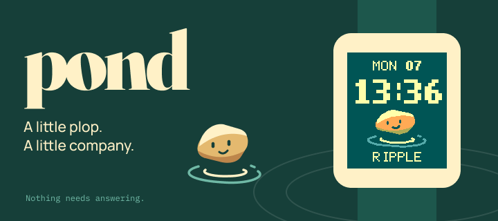

# Pond



A little shared pond for people wearing Pebble watches.

Drop a pebble. Somewhere, another wearer may feel a ripple. Nothing needs answering.

Pond is a community gift by [Monocursive](https://monocursive.com), free and open source under the [MIT licence](LICENSE). This monorepo contains a **C watchface**, **PebbleKit JS bridge**, and **Elixir / Phoenix server** backed by PostgreSQL. The service and landing page are live at [pond.monocursive.com](https://pond.monocursive.com); an early release is available in the [Pebble Store](https://apps.repebble.com/9101f10632be4625b5db4655). Physical comfort and battery testing are ongoing.

## Run the server

Requires Elixir/OTP, PostgreSQL, and the standard Pebble SDK for watch builds. Development was checked with Elixir 1.20.2 / OTP 29, PostgreSQL 17, Pebble Tool 5.0.40 / SDK 4.33.1, Node 22, and a C compiler. Mix dependencies are locked in `server/mix.lock`; the watch has no third-party JavaScript dependencies.

From the repository root:

```sh
docker compose up -d db
cd server
mix setup
mix phx.server
```

Phoenix listens at [localhost:4040](http://127.0.0.1:4040/health). The [settings page](http://127.0.0.1:4040/settings.html) can be previewed in a browser; saving/joining returns to the Pebble app through its settings webview. PostgreSQL is isolated on loopback port 55432 with development-only credentials. An existing PostgreSQL installation works too: set `DATABASE_URL` for development. Tests use the separate `pond_test` database on the same local server.

The [landing page](http://127.0.0.1:4040/) introduces Pond with an interactive, browser-only plop demo. Its source lives in `server/priv/static/landing/`: plain HTML, CSS, JavaScript, and local artwork/fonts, with no frontend build. The demo respects reduced motion and never sends drops to the service.

## Build the watchface

From the repository root:

```sh
cd watch
pebble build
pebble install --emulator aplite
```

The bundle is `watch/build/watch.pbw`, compiled for Aplite, Basalt, Chalk, Diorite, Flint, Emery and Gabbro. Use `pebble install --phone <phone-ip>` for a physical phone with its developer connection enabled. The default origin in `watch/src/pkjs/env.js` is `https://pond.monocursive.com`. Self-hosters should change it and rebuild; local development can select another origin in settings. `127.0.0.1` on a phone points to the phone itself.

The face starts locally, unjoined and silent. Open Pond's settings in the Pebble mobile app to join. Save settings, then reopen to inspect the watch acknowledgement. To prepare a drop, try two short, quick wrist twists—a quick back-and-forth motion. In the current build, this feels more like a wrist twist than a tap on the screen. Repeat the gesture within two seconds to cancel. Pond detects motion with the accelerometer and does not read screen touches, so there is no need to hit the glass. This guidance comes from Time 2 feedback; gesture comfort and accidental triggers still need physical testing across models. Switching away from Pond stops its watch-side activity. Wait at least 10 seconds between drops (100 maximum in a rolling day). The watch distinguishes `RATE LIMIT` and `NOT SENT` from `UNKNOWN`, which means acceptance could not be confirmed.

In watch version 0.1.3 and later, Gentle mode allows an immediate preview and optional accepted-drop tick outside quiet hours and pauses. The initial 24-hour hold and four-per-day/90-minute allowance apply only to incoming ripples. Save settings and reopen them after the watch acknowledges the change; previews also require a trusted watch clock and service sync.

## Check the implementation

From `server/`:

```sh
mix format --check-formatted
mix test
mix compile --warnings-as-errors
```

From the repository root:

```sh
node --test watch/test/*.test.js
cc -std=c11 -Wall -Wextra -Werror watch/src/c/policy.c watch/test/policy_test.c -o /tmp/pond-policy-test
/tmp/pond-policy-test
cc -std=c11 -Wall -Wextra -Werror watch/src/c/gesture.c watch/test/gesture_test.c -o /tmp/pond-gesture-test
/tmp/pond-gesture-test
cc -std=c11 -Wall -Wextra -Werror -Iwatch/test/stubs watch/src/c/drop_outbox.c watch/test/drop_outbox_test.c -o /tmp/pond-outbox-test
/tmp/pond-outbox-test
```

Then run `pebble build` from `watch/`. No root task runner or package manager workspace is needed.

## Server release

From `server/`, `MIX_ENV=prod mix release` builds a normal OTP release. Supply `DATABASE_URL`, `SECRET_KEY_BASE` and `PHX_HOST` as shown in `.env.example`; `mix phx.gen.secret` generates a signing secret. Terminate HTTPS at your deployment platform or reverse proxy, and keep PostgreSQL private.

```sh
_build/prod/rel/pond/bin/pond eval 'Pond.Release.migrate()'
_build/prod/rel/pond/bin/pond start
```

The VPS uses Kamal with migrations before startup and database readiness before traffic switching. See [deployment and backup operations](docs/DEPLOYMENT.md) for configuration, commands, verified live checks, and remaining offsite-backup and physical-device gates.

## Product and design

- [Architecture: events and database](docs/ARCHITECTURE.md) — diagrams and editable FigJam board.
- [Implementation status and remaining gates](docs/IMPLEMENTATION.md)
- [Protocol v1](docs/PROTOCOL.md)
- [First release](docs/FIRST-RELEASE.md) — implementation scope and release gates.
- [North star](docs/NORTH-STAR.md) — longer-term vision.
- [Original v0.2](docs/archive/PRODUCT-SPEC-v0.2.md) — preserved verbatim.
- [UI/UX design](design/DESIGN-HANDOFF.md) — editable Figma screens and exported artwork.

The first-release specification takes precedence over the north star. Later ideas are possibilities, not promised features. The [implementation status](docs/IMPLEMENTATION.md) records what the current prototype proves and what it does not.
