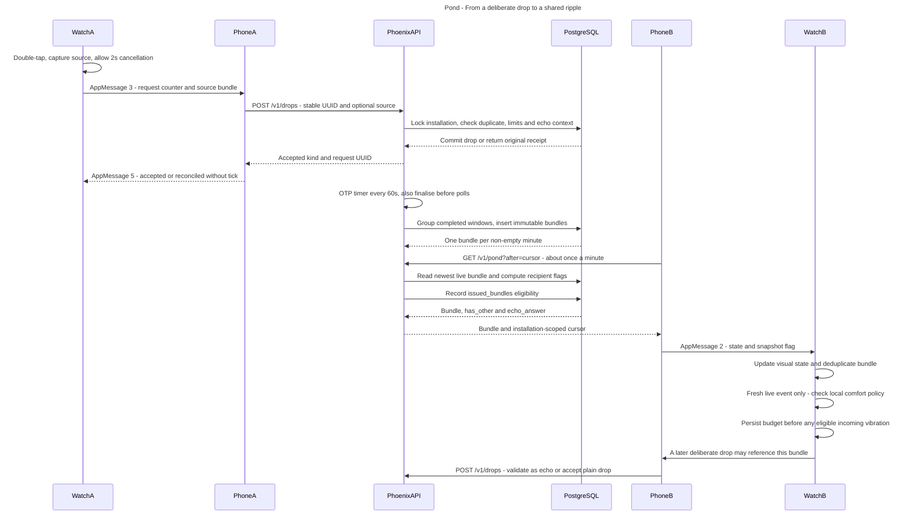
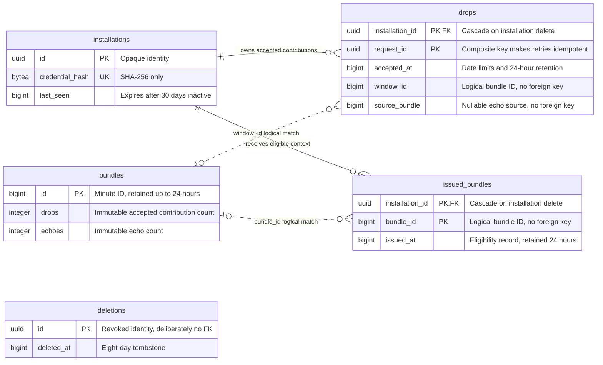

# Architecture: events and database

This describes the first implementation, checked against the source on 7 September 2026.

[Open the editable FigJam board](https://www.figma.com/board/tvOnb6475CcjAhz8TAqeVt).

## Responsibilities

| Component | Responsibility | Persistent state |
| --- | --- | --- |
| C watchface | Gesture, local time and visuals, settings acknowledgement, final haptic policy | Avatar/settings, deduplication and rolling incoming vibration budget |
| ES5 PebbleKit JS | AppMessage/HTTPS bridge, credential, bounded request retries, minute polling | Per-origin credential, request UUID/pending delivery, cursor, desired settings/revision |
| Phoenix | Authenticate, validate contributions, aggregate completed minutes, return recipient context | Uses Ecto/PostgreSQL; one OTP aggregator process |
| PostgreSQL | Transactional acceptance, idempotency, immutable minute totals, eligibility and revocation | Five tables below |

The phone sends commands and polls shared state. These are application events and database records, not a message-broker architecture. Phoenix has no event bus or WebSocket delivery service.

## From a drop to a ripple

Watch A and Watch B represent two wearers. Each phone runs the same bridge. The first request, reconnect, failure recovery and long-resume paths fetch a silent snapshot; they do not replay incoming haptics.

The installation/request UUID pair is the idempotency key. Retries reconcile the original receipt without creating another drop or replaying an acceptance tick. Acceptance checks the 10-second cooldown and 100 contributions per rolling 24 hours. An invalid or expired echo context is downgraded to a plain drop.

The aggregator finalises completed minute windows every 60 seconds and before polling. Advisory locks coordinate acceptance with finalisation; immutable bundle inserts tolerate repeated finalisation. Polling returns only the newest unseen live bundle, with an installation-scoped signed cursor. Issued context enables a later echo; recipient flags are computed from accepted contributions.

Incoming haptics require a fresh live event and the watch's local policy: Silent by default; Gentle allows at most four in rolling 24 hours, separated by at least 90 minutes, respecting quiet hours, pause, available system quiet state and trustworthy time. The watch reserves its persistent budget before vibrating.

## PostgreSQL model

The two solid relationships are actual foreign keys with cascade deletion. Dotted relationships are logical matches, not database constraints: `drops.window_id`, `drops.source_bundle` and `issued_bundles.bundle_id` refer to minute IDs without foreign keys. A drop exists before its minute is finalised; anonymous bundle totals can outlive deleted contributors. `source_bundle` is a second logical link to a prior bundle, represented by the field rather than a duplicate edge.

`deletions.id` deliberately has no foreign key: revocation must survive deletion or an uncertain bootstrap. Leaving inserts a tombstone and removes the installation with its drops and issued context. Late registration using that identity is rejected while the tombstone remains. Aggregate bundles are not rewritten.

| State | Lifetime |
| --- | --- |
| Raw drops and issued context | 24 hours |
| Aggregate bundles | 24-hour retention; live for 2 minutes after their minute closes |
| Installation | 30 days without activity |
| Deletion tombstone | 8 days |
| Watch preferences/avatar/haptic budget | Local only; never in this database |

Reads enforce expiry; startup/hourly cleanup removes expired rows, so physical removal can lag the cutoff by one cleanup interval.

## Implementation references

- [HTTP and AppMessage contracts](PROTOCOL.md)
- [Pond context and transactions](../server/lib/pond/pond.ex)
- [OTP aggregation and cleanup](../server/lib/pond/aggregator.ex)
- [Database migration](../server/priv/repo/migrations/20260907000000_create_pond.exs) and [window_id rename](../server/priv/repo/migrations/20260907000001_rename_window.exs)
- [Implementation status](IMPLEMENTATION.md)
